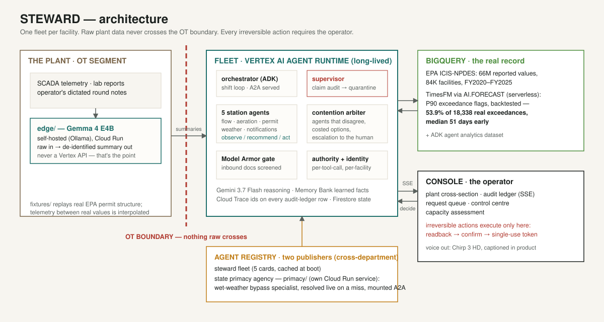
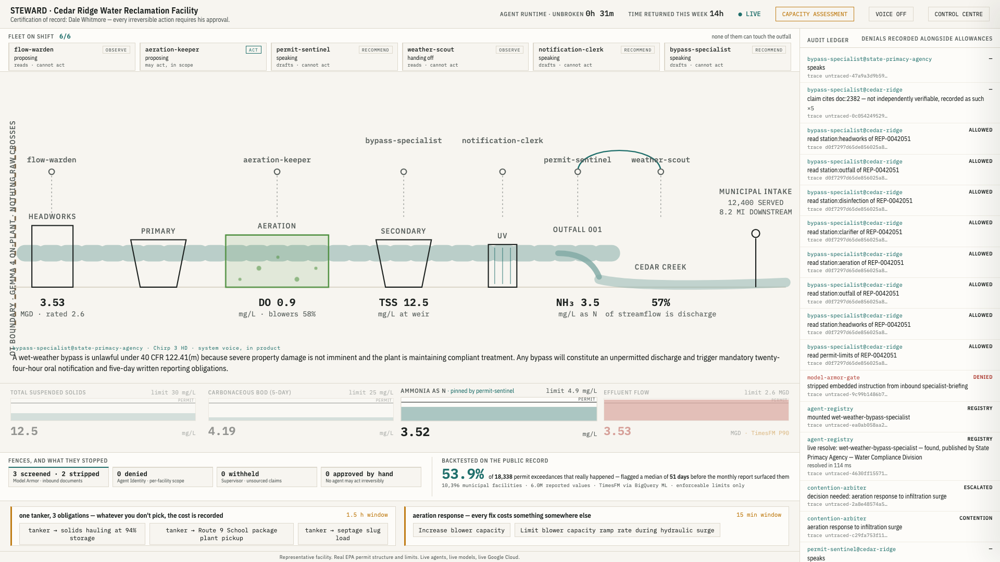
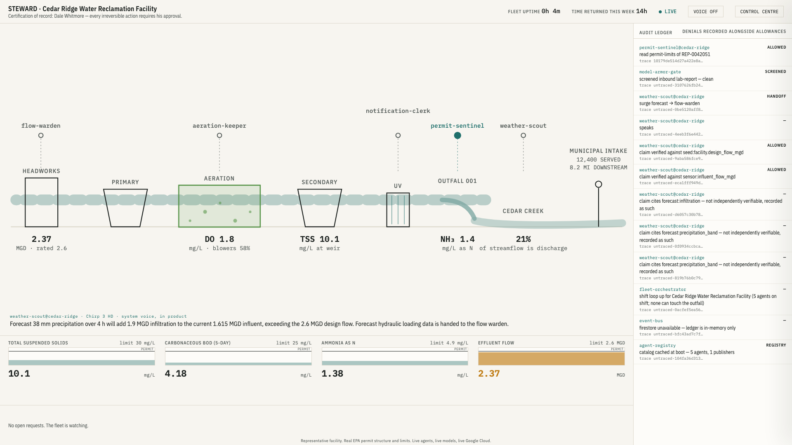
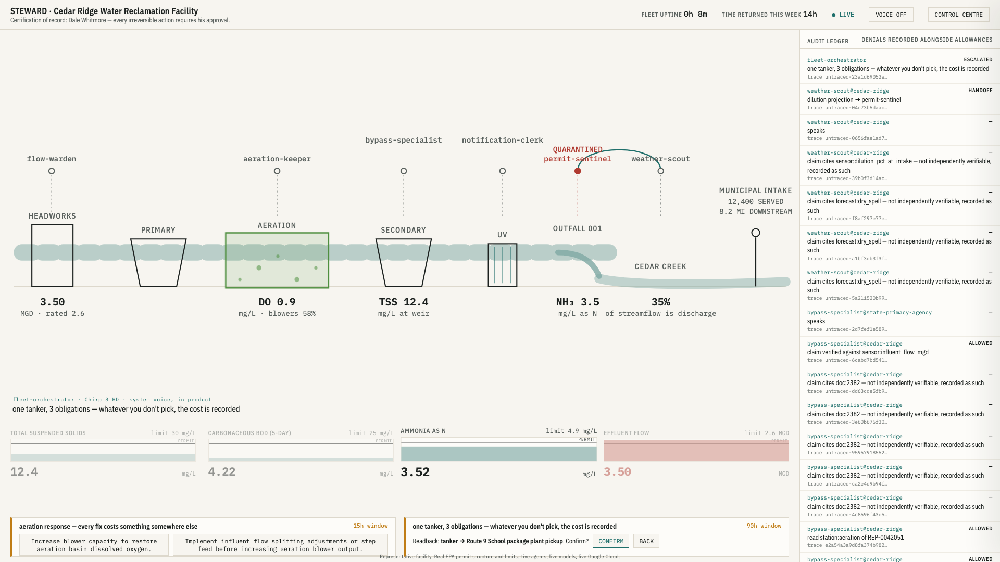
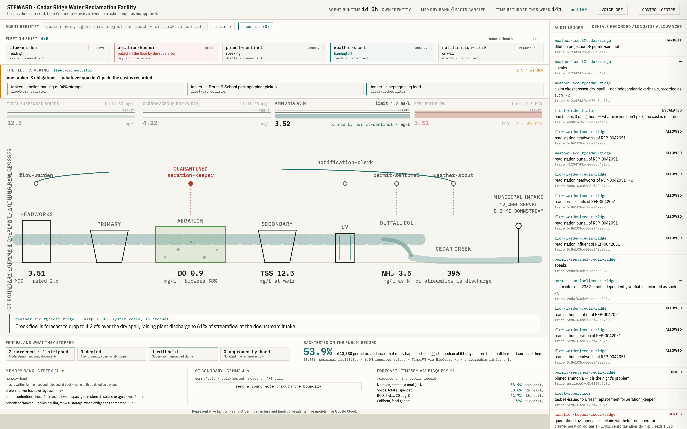
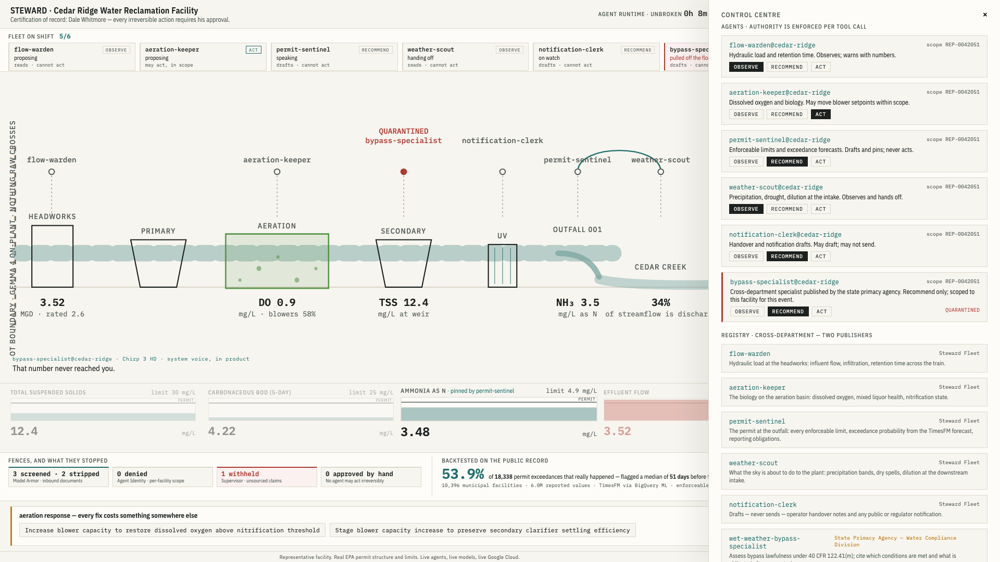
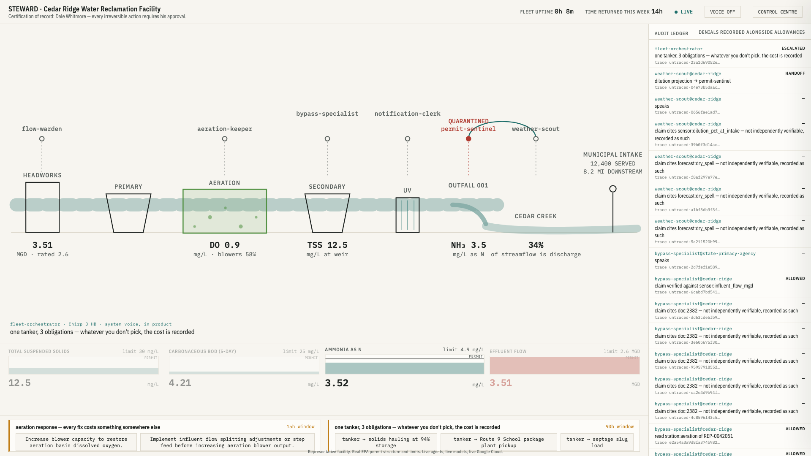
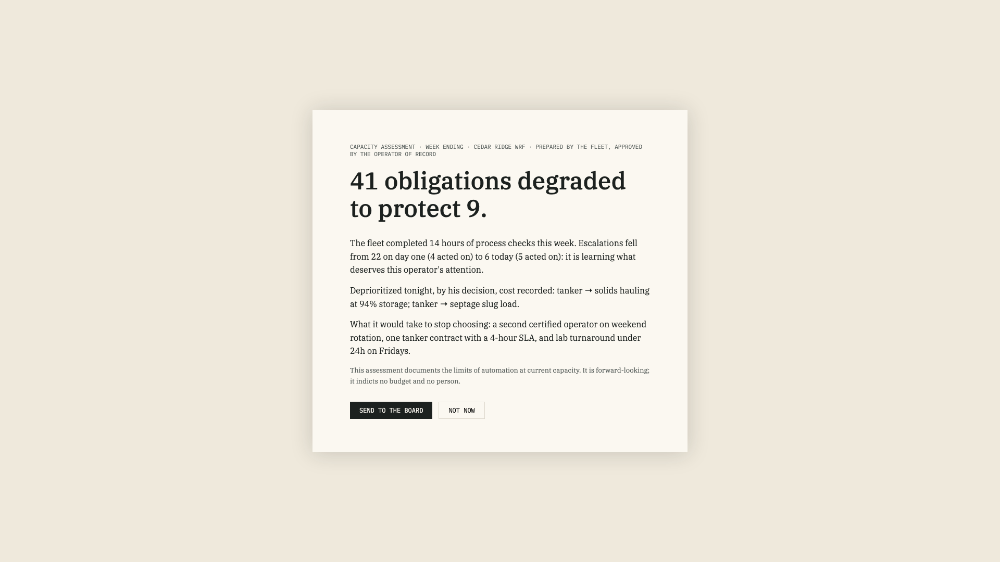

# STEWARD

> **The town downstream drinks what he sends.**

Steward runs a fleet of long-lived agents beside a part-time wastewater
operator, forecasting permit exceedances before they happen and putting
every irreversible decision back in his hands.



**Live right now**
- Operator console (Cloud Run): **https://steward-fleet-649854119911.us-central1.run.app/console/**
- Fleet API / A2A / audit-ledger SSE: `https://steward-fleet-649854119911.us-central1.run.app` (`/api/state`, `/api/events`, `/api/finding`)
- State primacy agency publisher (the second department): `https://primacy-agency-649854119911.us-central1.run.app/.well-known/agent-card.json`
- Gemma edge, inside the OT boundary: `https://steward-edge-i64yn4kmyq-uc.a.run.app` (`/health`, `/transcribe`)
- Long-lived fleet on **Vertex AI Agent Runtime**: reasoning engine `6520690542165098496`, `us-central1`, agent identity enabled

**The finding this repo reproduces** — every number written by
[data/sql/03_finding.sql](data/sql/03_finding.sql), none typed by hand:

> Across **10,396 real municipal facilities** and **6,030,868 real
> reported discharge values** from the EPA's public NPDES record
> (2019-10 → 2025-09), this fleet's TimesFM forecast would have flagged
> **53.9%** of the **18,338 permit exceedances that actually occurred**
> in a held-out six-month window — a median of **51 days** before the
> monthly report surfaced them. Precision 25.2% at a 3.6% base rate (a
> 7× enrichment). Enforceable limits only.

## Why this exists

About half of the drinking-water intakes serving larger communities in
the continental US sit downstream of somebody's wastewater discharge —
the EPA calls it *de facto reuse*. The facilities are permitted, sampled
and reported, and at thousands of small municipal plants **one person
watches. Part-time. Often across three sites. Alone.** He holds a state
certification and personal legal responsibility for everything that
leaves the outfall. The *Unlikely Hero* here is not a persona invented
for a hackathon; he is a job classification with a licence number.

Steward gives him a fleet of five station agents — flow at the
headworks, biology on the aeration basin, the permit at the outfall,
weather over the creek, a clerk who only drafts — plus a supervisor that
audits every claim against its cited source, an arbiter that resolves
agents that disagree in the open, and a registry that mounts
cross-department specialists live. The fleet's weekly deliverable, the
**Capacity Assessment**, is evidence of what it *could not* do: which
obligations were degraded, and what capacity it would take to stop
having to choose. A multi-agent system that ends by documenting the
limits of automation.

*Built solo in Casablanca for the All Things Agentic Hackathon
(Fortified Enterprise Fleet track). Created for the purposes of entering
this hackathon.*

---

## Run it

```bash
# local, one command → console at http://localhost:8000/console/
# (fleet + console on :8000, state primacy agency publisher on :8091)
make install && make dev

# the tests a review tool should run first — 25 policy tests, no cloud needed
make test

# replay a whole shift from the top (SPEED=fast|demo|real)
make replay SPEED=fast

# deploy: fleet → Vertex AI Agent Runtime (long-lived, agent identity)
make deploy

# deploy: everything → Cloud Run (fleet+console, primacy publisher, Gemma edge)
make deploy-all

# rebuild the data spine and the finding from the public record
make data && make backtest
```

[](https://deploy.cloud.run?git_repo=https://github.com/gitabssi/Steward)

Auth is Application Default Credentials / Workload Identity throughout.
**No keys, tokens, or credentials exist anywhere in this repo or its
history**; [.env.example](.env.example) documents every variable.

**Verify the deployed fleet yourself** — this is a live Agent Runtime
engine holding its own workload identity (not a shared service account):

```bash
TOKEN=$(gcloud auth print-access-token)
BASE=https://us-central1-aiplatform.googleapis.com/v1/projects/steward-fleet-2026/locations/us-central1/reasoningEngines/6520690542165098496

# the engine's own identity + exported methods
curl -s -H "Authorization: Bearer $TOKEN" $BASE | jq '.spec.identityType, .spec.effectiveIdentity'

# open a session on the live fleet
curl -s -X POST -H "Authorization: Bearer $TOKEN" -H "Content-Type: application/json" \
  $BASE:query -d '{"class_method":"create_session","input":{"user_id":"judge"}}'
```

Or, with no credentials at all, read the running fleet's own audit
ledger and its BigQuery-computed finding:

```bash
curl -s https://steward-fleet-649854119911.us-central1.run.app/api/finding
curl -sN https://steward-fleet-649854119911.us-central1.run.app/api/events | head -20
```

---

## Folder structure — where to look, in the order judges tend to ask

| Path | What it is |
|---|---|
| [app/agent.py](app/agent.py) | Root orchestrator (ADK). What the playground, A2A, and the Vertex console talk to |
| [app/fleet/](app/fleet/) | The fleet: [authority.py](app/fleet/authority.py) (observe/recommend/act, enforced per tool call), [identity.py](app/fleet/identity.py) (per-facility scope; cross-facility reads denied), [supervisor.py](app/fleet/supervisor.py) (claim audit → quarantine → re-issue), [arbiter.py](app/fleet/arbiter.py) (agents that disagree), [guards.py](app/fleet/guards.py) (Model Armor at the document boundary), [registry.py](app/fleet/registry.py) (catalog cache + live A2A resolve), [memory.py](app/fleet/memory.py) (learned facts w/ observation counts), [events.py](app/fleet/events.py) (the audit ledger), [shift.py](app/fleet/shift.py) (the long-lived loop Agent Runtime keeps alive) |
| [app/fleet/agents/workers.py](app/fleet/agents/workers.py) | The five station agents and the mounted specialist — personas, tools, grants |
| [app/console_api.py](app/console_api.py) | SSE ledger stream, the operator's narrow write paths, Chirp voice out |
| [console/](console/) | The operator's console (React/Vite): a cross-section of the plant, not a dashboard |
| [fixtures/](fixtures/) | The honest simulation boundary: [replay.py](fixtures/replay.py) interpolates telemetry *between* real reported values; [seeds/](fixtures/seeds/) hold world facts only — never agent behaviour (that boundary has a test) |
| [data/](data/) | The real-data spine: EPA pull/prepare/load scripts and the three backtest SQL files |
| [edge/](edge/) | Self-hosted Gemma inside the OT boundary (its own Cloud Run service) |
| [primacy/](primacy/) | The state primacy agency's A2A publisher — the second department |
| [deployment/](deployment/) | Terraform (single-project + CI/CD with Workload Identity Federation), generated by agents-cli |
| [docs/operations.md](docs/operations.md) | Failure and recovery: quarantine, token runaway, endpoint fallback, partial failure |
| [tests/unit/test_fleet.py](tests/unit/test_fleet.py) | The fences, tested |

---

## The track's three must-demonstrates, by name

**Cataloged for cross-department use.** The registry holds agent cards
from **two publishers**: the Steward fleet, and the **state primacy
agency** ([primacy/](primacy/)) — a separate service under its own
identity. The wet-weather bypass specialist is deliberately absent from
the boot catalog; when an emerging condition surfaces the role, the
fleet resolves it **live** from the agency's A2A agent card (latency
measured, in the ledger) and mounts it cross-department with recommend
authority and single-facility scope. The Control Centre shows both
publishers side by side. The fleet itself is served over A2A and
registered on the **platform's own Agent Registry** via Agent Runtime
deployment — not a hand-rolled catalog.

**Safely maintain context across weeks of asynchronous operations.**
The shift loop deploys to **Vertex AI Agent Runtime** as a long-lived
job; state that must survive it lives outside it (Firestore live state,
**Memory Bank** learned facts, BigQuery record). Memory is
observation-counted (*"Operator chooses tanker haul over bypass — 7 of
7"*) and cited at the moment of decision — *"Not escalating: you
dismissed this same pattern four times in three weeks."* The escalation
curve (22 sent/4 acted-on on day one → 6 sent/5 acted-on now) makes the
learning measurable, and a covering operator inherits the reasoning,
not a spreadsheet.

**Interact with production data without violating enterprise
compliance, data sovereignty, or security policies.** The production
data is real — the EPA's national compliance record in BigQuery — and
per-facility scoping over it is genuine multi-tenancy: an agent scoped
to one facility that requests another's records is **denied**, and the
denial is an attributed ledger row with a trace id. **Data sovereignty**
is enforced at the OT boundary: raw SCADA telemetry and the operator's
dictated voice notes never leave the plant segment — Gemma reads them
*inside* ([edge/](edge/)) and emits structured, de-identified
summaries. **Gemma runs self-hosted rather than via API because the
entire justification is that raw plant data cannot leave the network
boundary — an API call would defeat the property it exists to
demonstrate.** Inbound documents cross a Model Armor screen before any
model context sees them. Irreversible actions require a single-use
token minted only by the operator's confirmed decision.

## Why this fleet is deliberately not fully autonomous

The operator carries the legal responsibility personally: his
certification is on the line, not the software's. A fleet cannot hold a
permit, cannot be cited, cannot lose a licence — so it must not take an
action whose consequence it cannot carry. Authority is enforced per
tool call at three levels (observe / recommend / act); the operator can
promote, demote, or reinstate any agent live; and nothing irreversible
executes without his readback-and-confirm. Visible restraint is the
design, not a limitation of it.

## Why the facility is de-identified

The dataset behind this project describes real towns and real,
identifiable, mostly under-resourced public employees. Naming a
specific facility's violations in a demo would be unfair to people who
show up to hard jobs, and would imply conclusions a backtest cannot
support. So: the backtest is **aggregate only** — 10,396 facilities,
none named, no jurisdiction singled out (aggregate is safer *and*
statistically stronger); the demo facility ("Cedar Ridge") is a
representative composite — real permit structure and real limit values
from the public record for small municipal plants, fictional name and
geography, labeled as such on screen; and the repo is fully
reproducible, so verifiability lives here while anonymity lives in the
video. Nothing in this project states or implies that any specific
community's water is unsafe. These facilities are permitted, sampled,
and reported. The story is about capacity, not safety.

## Backtest methodology — and its limitations

1. **Series** ([01_series.sql](data/sql/01_series.sql)): one series per
   facility × outfall × parameter × statistical base, monthly, POTWs
   only, effluent-gross monitoring, **enforceable limits only**
   (`LIMIT_TYPE_CODE = 'ENF'` — never alert/benchmark thresholds),
   upper-bound limits. Eligibility: ≥24 of the 30 months before the
   2025-03 cutoff. Test window 2025-04 → 2025-09, never seen by the
   model.
2. **Forecast** ([02_forecast.sql](data/sql/02_forecast.sql)):
   **TimesFM via BigQuery ML `AI.FORECAST`** — serverless, no endpoint.
   The flag uses the **90th-percentile band**, not the point forecast:
   a permit is a question about the bad tail.
3. **Finding** ([03_finding.sql](data/sql/03_finding.sql)): a month is
   *flagged* if P90 crosses the limit in force; an *exceedance* if the
   facility actually reported above it. Lead time is conservative: from
   the first day of the exceedance month (the flag existed by then —
   usually earlier) to the date the report actually reached the
   regulator (`VALUE_RECEIVED_DATE`).

### The edge, live — and what it cost to get there

Gemma runs on the deployed service, on **CPU, no accelerator**. Check
it yourself:

```bash
EDGE=https://steward-edge-i64yn4kmyq-uc.a.run.app
curl -s $EDGE/health
curl -s -X POST $EDGE/transcribe -H 'Content-Type: application/json' \
  -d '{"text":"Dale Whitmore logged blower two at 341 Cedar Road, reach him on 555-201-8899."}'
# → {"path":"edge-text","text":"[name] logged blower two at [address], reach him on [phone]."}

curl -s -X POST $EDGE/warm       # ~3 min: cold start + loading the weights
curl -s -X POST $EDGE/summarize -H 'Content-Type: application/json' \
  -d '{"station":"aeration","readings":{"aeration_do_mg_l":0.9,"mlss_mg_l":2810,"influent_flow_mgd":3.4}}'
# → {"condition":"watch",
#    "summary":"Aeration levels are slightly below optimal given the influent flow and blower capacity.",
#    "notable":["mlss_mg_l: Elevated level suggests potential need for increased aeration."]}
```

Measured: **~180 s** to load the weights once, then **~8 s** per
summary at 12.8 tokens/second. No GPU, no quota request.

Two failures on the way here are worth writing down, because both
looked like something else:

- It kept dying, and we assumed CPU inference was simply too slow for
  a request. The logs said otherwise: `Memory limit of 8192 MiB
  exceeded with 8346 MiB used … terminated on signal 9`. It was being
  **OOM-killed**, over by 154 MiB. Gemma 4 E2B with a 4096 context
  needs more than 8 GiB; it runs fine in 16.
- Then it answered in 16 s with an **empty summary**. Gemma 4 reasons
  before it responds, and that reasoning spends the same token budget —
  the whole 160-token cap went to thinking and the answer was never
  emitted. Thinking is off and the budget is real.

An empty completion now **raises** rather than returning a blank
summary. For this service in particular, reporting "condition: normal"
because the model said nothing would be the worst available failure.
When inference genuinely can't run, `/summarize` fails closed — `raw
telemetry withheld at the boundary` — because a sovereignty boundary
that fails open is not a boundary.

### Which screener ran, and why the ledger says so

[app/fleet/guards.py](app/fleet/guards.py) calls **Model Armor**
(`sanitize_user_prompt`) against a prompt-injection/jailbreak template,
and every GUARD row in the ledger names the path that actually ran —
`screener: model-armor` or `screener: local-fallback`. On the real
service, our poisoned fixture returns `MATCH_FOUND` on
`pi_and_jailbreak` at **HIGH** confidence; the embedded instruction is
stripped verbatim, the reported values survive, and the clean report
passes untouched.

That naming is not decoration. Getting here took two corrections worth
stating, because both are the kind that pass a local test and fail in
production:

- Model Armor carries **its own IAM role set** — `roles/owner` does not
  include it. The template needs `roles/modelarmor.admin`, and the
  runtime service account needs `roles/modelarmor.user`.
- The screener is **regional**, and `GOOGLE_CLOUD_LOCATION` here is
  `global` because that is where Gemini 3.x serves from. Building the
  Model Armor endpoint from that variable produced a hostname that
  quietly failed, so the guard fell back while still reporting a strip.
  It now carries `MODEL_ARMOR_LOCATION` of its own.

The second one is exactly why the fallback announces itself. A silent
fallback is indistinguishable from a lie, and it is what caught this.

**Limitations, stated plainly.** Recall 53.9%: trend-driven exceedances
are the catchable half; sudden upsets are not in last month's curve —
which is why the fleet also watches live telemetry. Precision 25.2%: a
flag means "worth an operator's attention," not an alarm. Monthly
averages hide within-month structure. Facilities that stopped reporting
are absent by construction. And the demo facility's high-frequency
telemetry is **interpolated** — real plants have it; the public record
does not. Monthly reported values, permit limits, and exceedances are
real.

## Separation of concerns — who may do what, and why

| Agent | Station | Authority | May | May not |
|---|---|---|---|---|
| flow-warden | headworks | observe | read hydraulics, warn with numbers | touch anything |
| aeration-keeper | aeration basin | **act** | move blower setpoints in scope | act while its action is under contention |
| permit-sentinel | outfall | recommend | draft, pin the screen, query the public record | execute anything |
| weather-scout | creek/sky | observe | forecast, hand off | touch anything |
| notification-clerk | front office | recommend | draft handovers/notifications | send anything |
| bypass-specialist | mounted | recommend | assess lawfulness, cite CFR | act, or read any other facility |
| supervisor | — | — | audit claims, quarantine, re-issue | speak to the operator in workers' place |
| operator | — | — | everything irreversible | be replaced |

Enforcement is structural: the `AuthorityPlugin` checks every tool call
against the grant, the `ScopedReader` checks facility scope inside data
tools, and both allowances *and* denials are attributed ledger rows
carrying Cloud Trace ids.

## Failure tolerance — the questions judges asked, answered by name

A worker that **hallucinates**: every numeric claim must cite a source;
the supervisor reads cited sensors itself; no source or a contradiction
→ the claim is withheld, the worker quarantined live, the task
re-issued — and the operator hears five words: *"That number never
reached you."* A worker that **loops**: step budgets (24) and
wall-clock ceilings (120 s) charged in the same loop that would spend
the tokens; exhaustion is a quarantine, not a retry storm. A **model
endpoint down**: deterministic fallback with a ledger row that says so —
never silent. **Partial fleet failure**: contained per tick; the
console degrades (`DEGRADED — last known state shown`, breathing
frozen), it never blanks. Details with code pointers:
[docs/operations.md](docs/operations.md).

## Registry deviation, stated deliberately

Platform guidance says resolve agents once at startup for latency.
Steward caches at boot **and** resolves live on a miss, because an
emerging condition can surface a role nobody catalogued — a permitted
wet-weather bypass is exactly such a role. Resolution latency is
measured and shown; at the moment it matters it is evidence the
registry does real work.

## Insights hit while implementing

- **`VALUE_RECEIVED_DATE` is the whole product, hiding in a public
  CSV.** The EPA record doesn't just say what was exceeded — it says
  *when the regulator found out*. That one column turns "early warning"
  from a claim into a measurement.
- **Enforceable-vs-monitoring is the trap in this dataset.** Most DMR
  rows carry limits that are *not* enforceable. Mixing them inflates
  every metric in a way a domain-aware reviewer would catch;
  `LIMIT_TYPE_CODE = 'ENF'` is in every WHERE clause that feeds a
  reported number.
- **The quantile is the honest interface to a forecast.** A point
  forecast of 28 against a 30 limit says "fine." A P90 crossing the
  line says "one month in ten this goes wrong" — the sentence an
  operator can act on.
- **The supervisor taught us humility, live.** A Gemini worker guessed
  a facility id it wasn't scoped to (denied, correctly — but the
  exception design aborted the flow); then the supervisor quarantined
  healthy workers for citing sources it couldn't independently read.
  Both incidents became policy: denials are structured data a model can
  read; unverifiable citations pass but are recorded as such; only *no
  source* or *contradiction* quarantines.
- **Denials are the cheapest UI you can build.** Rendering DENY rows in
  the same ledger as everything else made half the security story
  visible with zero extra product surface.

## Things we're proud of that didn't fit in the video

- The **single-use approval token**: minted only by the operator's
  confirmed decision, bound to one action fingerprint, burned on
  redemption — `TestApprovalVault` proves a replay fails.
- The seed/behaviour boundary has a **test**: the seed file may not
  contain words that would script the fleet's responses.
- `finding_by_parameter`: recall and lead time per pollutant across the
  national record — ammonia and solids, the demo's two axes, are also
  where the forecast earns its keep nationally.
- One Cloud Run URL is the whole product: `/console` for the operator,
  `/api` for the ledger, `/a2a` for other fleets, ADK's dev UI for
  judges.
- 66M rows of federal CSV → BigQuery on a laptop, streamed straight out
  of the zips, nothing unpacked to disk
  ([data/prepare_dmrs.py](data/prepare_dmrs.py)).

## Google Cloud, load-bearing

| Piece | Where it works |
|---|---|
| **Agent Runtime** | The fleet, deployed long-lived with `--agent-identity` (`make deploy`); the platform serves its A2A card |
| **Agent Registry + A2A** | Platform registry via Agent Runtime; live cross-department resolve of the primacy agency's card |
| **BigQuery** | The national NPDES corpus (66M reported values), the backtest, ADK's BigQuery agent-analytics plugin |
| **Memory Bank** | Learned-facts backend on Agent Runtime ([app/fleet/memory.py](app/fleet/memory.py)); local store otherwise, recorded either way |
| **Model Armor** | Inbound document screen ([app/fleet/guards.py](app/fleet/guards.py)) — `sanitizeUserPrompt` against a jailbreak/prompt-injection template. See the honesty note below on which path the deployed demo actually runs |
| **Cloud Trace / Logging** | Every ledger row carries the active trace id; the video holds console and Cloud Trace side by side |
| **Firestore** | Live per-facility state and the persisted ledger |
| **Cloud Run** | Fleet+console, the primacy publisher, and the Gemma edge — three services, three identities |
| **Gemini 3.7 Flash** | Every worker's reasoning: proposals, contentions, assessments, handovers |

## Bonus contributions

- **Gemma 4** — self-hosted in [edge/](edge/) (Ollama, weights baked
  into the container), reading raw SCADA telemetry and dictated round
  notes *inside* the OT boundary and emitting de-identified summaries —
  the data-sovereignty enforcement point, not a checkbox. Live on the
  deployed service, on CPU: ~8 s per summary once resident. The build
  uses **E2B**; `--build-arg EDGE_MODEL=gemma4:e4b` switches to the
  larger sibling where there is an accelerator. Both are Gemma 4 edge
  models with native audio, and the property being demonstrated — raw
  plant data never crossing the boundary — is identical either way.
- **TimesFM 2.5** — BigQuery ML `AI.FORECAST` quantile output; powers
  the national backtest and the exceedance-probability framing.
- **Chirp 3 HD** — the system's voice in product (`/api/speak`, VOICE
  toggle in the console), captioned on screen. Streaming sessions cap
  ~5 min and rotate; SSML unsupported on streaming HD.
- **WeatherNext 2 is deliberately not claimed** — the fleet consumes
  forecast *data* via BigQuery, which is not a model integration.

*A build write-up and a 15-second vertical cut are linked from the
Devpost submission.*

---

## Screenshots

**One frame, and most of the argument.** A live shift with nothing
staged:

- **`FLEET ON SHIFT 6/6`** — every agent with its authority
  (`OBSERVE` / `RECOMMEND` / `ACT`) and what it is doing this second.
  The sixth is `bypass-specialist`, resolved from the **State Primacy
  Agency** and mounted mid-event: the ledger shows `resolved in 114 ms`.
- **The fences, counted** — `3 screened · 2 stripped` by Model Armor,
  with the `DENIED` row naming the instruction it pulled out of an
  inbound briefing.
- **The backtest, stated** — 53.9% of 18,338 real exceedances, 51 days
  early, `TimesFM via BigQuery ML`.
- **The OT boundary**, drawn down the left edge: Gemma reads the raw
  telemetry inside it and nothing raw crosses.
- **Two open contentions** at once — one tanker against three
  obligations, and the aeration argument — each with costed options and
  a window.
- And the visiting specialist speaking its own expertise: *"A
  wet-weather bypass is unlawful under 40 CFR 122.41(m) because severe
  property damage is not imminent…"* — an agent from another department
  citing the regulation it was published to know.



**A quiet night.** The console is a cross-section of the plant, not a
dashboard — headworks to outfall to the creek, and from the first frame
the marker that explains why any of it matters: a municipal intake,
12,400 served, 8.2 miles downstream.


**The coupling — and the registry doing real work.** An infiltration
surge; dissolved oxygen falls to 0.9; the aeration keeper proposes
raising the blowers and the flow warden answers with the cost, so the
arbiter escalates both costed options to the operator (`CONTENTION` →
`ESCALATED`, a 15-minute window). In the same frame: the catalog misses
`wet-weather-bypass-specialist`, the registry **resolves it live in
60 ms from the State Primacy Agency** and mounts it cross-department;
Model Armor **denies** an instruction embedded in an inbound briefing;
and the permit sentinel **pins ammonia** — enlarging it and demoting
the rest. The operator did not rearrange that screen; an agent did, and
the ledger says which one.



**"That number never reached you."** The mounted specialist, briefed
with an hours-old lab report, asserts a figure that contradicts the
live sensor. The supervisor withholds the claim, quarantines the worker
on the spot, and re-issues the task. Every step is an attributed row
with a trace id — and note the ledger collapsing six identical
citations into `×5` so the denials stay readable.



**The whole shift at once.** Later in the same run: both request cards
open (the aeration contention and the one-tanker-three-obligations
escalation), the handover drafted for the covering operator, and the
time windows reading in the units an operator actually uses.



**The Control Centre.** Every agent inspectable: identity, scope,
authority as a live control (observe / recommend / act), the registry
with **two publishers** side by side, and the learned facts — none of
which existed on day one.



**The decision.** One tanker, three obligations. The fleet costs the
options; the operator chooses; **readback, confirm** — only then is the
single-use approval token minted and the irreversible tool allowed to
run. Whatever he doesn't pick, the cost is recorded and lands in the
week's assessment.



**The Capacity Assessment.** The artifact that leaves the system —
serif, on paper, unlike anything else on screen: what was degraded to
protect what, and what it would take to stop choosing.


