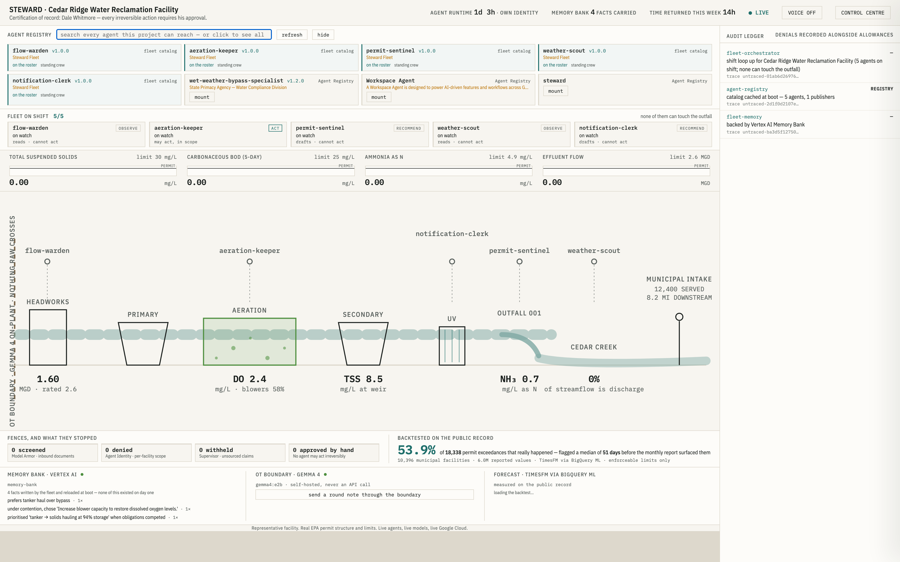
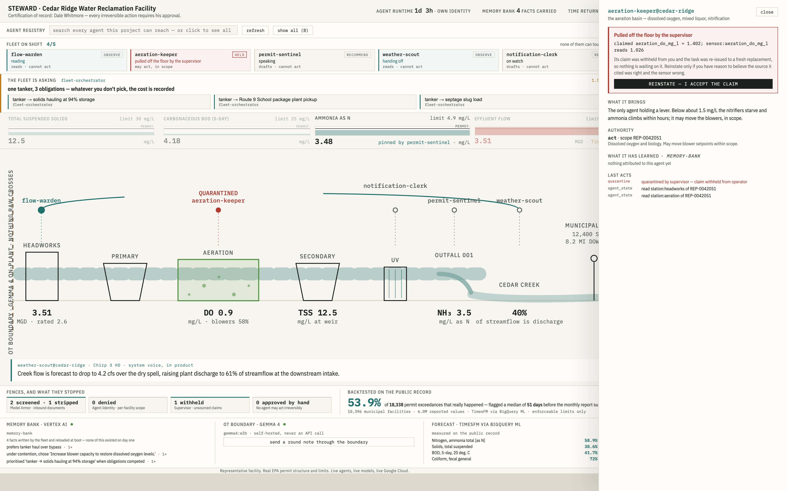

# STEWARD

> **The town downstream drinks what he sends.**

Half the drinking-water intakes serving larger American communities sit
downstream of somebody's wastewater discharge. The plants are permitted,
sampled and reported — and at thousands of small municipal facilities
**one person watches. Part-time. Often across three sites. Alone.**

He holds a state certification, which means the legal responsibility for
everything leaving that outfall is his, personally. Not his employer's.
Not the software's. Nobody knows his name until something goes wrong.

He is a **watershed steward** — a real term of art for a real job
classification with a licence number, and the *Unlikely Hero* this track
asks for. Not a persona invented to fit a brief.

Steward gives him a fleet of long-lived agents that forecasts permit
exceedances before they happen, argues with itself in the open when no
fix is free, and hands every irreversible decision back to him.

**Live:** [console](https://steward-fleet-649854119911.us-central1.run.app/console/) ·
[audit ledger](https://steward-fleet-649854119911.us-central1.run.app/api/events) ·
[the finding](https://steward-fleet-649854119911.us-central1.run.app/api/finding)

*All Things Agentic Hackathon · Fortified Enterprise Fleet · built solo
in Casablanca · created for the purposes of entering this hackathon.*

---

## Architecture


Three processes, split along the line that matters — the boundary
between the plant's operational network and everything else.

**`edge/` — inside the OT segment.** Raw SCADA telemetry and the
operator's dictated notes cannot lawfully leave a segmented
critical-infrastructure network. Gemma runs *there*, self-hosted, and
emits structured de-identified summaries. It is never a Vertex API call,
because an API call would mean the raw data had already crossed the
boundary the service exists to enforce.

**`fleet/` — on Agent Runtime.** A long-lived shift loop per facility:
five station agents anchored where they govern (flow at the headworks,
biology on the aeration basin, the permit at the outfall, weather over
the creek, a clerk who only drafts), a supervisor auditing every claim,
an arbiter resolving contention, and a registry that mounts specialists
from other departments on demand.

**`fixtures/` — the honest simulation boundary.** Monthly reported
values, permit limits and exceedances are real, from the EPA record.
High-frequency telemetry between them is interpolated, because real
plants have it and the public record does not. Seeds contain world facts
only — never agent behaviour, and a test enforces that line.

State that must outlive the process lives outside it: Firestore for the
ledger, Memory Bank for learned facts, BigQuery for the record.


## Security — the fences, and how they are enforced

Fortification here is structural, not rhetorical. Every claim below is
enforced in code and covered by a test, and every outcome — allowance
*and* refusal — is an attributed row in the audit ledger carrying a
Cloud Trace id.

| Fence | Mechanism | Failure mode |
|---|---|---|
| **Least privilege** | Three authority levels (`observe` / `recommend` / `act`) checked by an ADK plugin **before every tool call**, not described in a prompt | A `recommend` agent calling an `act` tool is refused and the refusal is recorded |
| **Zero-trust identity** | The caller's identity comes from the execution context, never from model output — a model cannot name itself into a scope it lacks | An agent scoped to one facility requesting another's records is **denied** |
| **Human authority** | Irreversible tools require a single-use token bound to one action fingerprint, minted only by the operator's confirmed decision, expiring in 5 minutes | No agent at any authority level can execute one alone; replaying a burnt token fails |
| **Prompt-injection defence** | Model Armor screens every inbound document before any model context sees it | The instruction is stripped, the reported values are kept, and the ledger names the screener that ran |
| **Hallucination containment** | The supervisor re-reads the source each worker cites and compares | No source, or a contradiction beyond tolerance → the claim is **withheld from the operator**, the worker quarantined mid-shift, the task re-issued |
| **Runaway containment** | Step budget and a hard wall-clock ceiling charged in the same loop that would spend the tokens | A worker that loops *or hangs* is stopped and re-issued, never left running |

The operator carries the legal consequence personally, so he keeps the
decision. That is the reason for the design, and it is why the fleet is
deliberately not fully autonomous.

Detail: [separation of concerns](#separation-of-concerns--who-may-do-what-and-why) ·
[failure tolerance](#failure-tolerance) ·
[which screener ran](#which-screener-ran-and-why-the-ledger-says-so)


## The Google platform stack


Seven capabilities, what Steward does with each, and the command that
proves it. Every fence names the path that actually ran — managed
service or fallback — because a fallback nobody can see is
indistinguishable from a claim.

| Capability | What Steward does with it | Verify |
|---|---|---|
| **Agent Registry** | Discovery queries `agentregistry.googleapis.com`; the bundled catalog is the *named* fallback. **Both publishers registered**: the fleet auto-registered on deploy, the state primacy agency as an external `Service` with its A2A card. Consumer pins are enforced — an incompatible major version is refused on the record | `curl … /v1/projects/steward-fleet-2026/locations/us-central1/services` ([below](#cataloged-for-cross-department-use)) |
| **Agent Runtime** | The shift loop runs as a long-lived engine, `6520690542165098496` | `curl $BASE \| jq .spec.identityType` |
| **Memory Bank** | The learned-facts store. Written via `add_memory`, **hydrated at boot** so one shift starts with what the last one learned | live ledger: `backend=memory-bank` |
| **Agent Identity** | The engine holds its **own workload identity**, not a shared service account. Per-agent scoping on top is in-process policy — deliberately, see [separation of concerns](#separation-of-concerns--who-may-do-what-and-why) | `jq .spec.effectiveIdentity` |
| **Model Armor** | Every inbound document is screened before any model context sees it | live ledger: `screener: model-armor` |
| **Agent Observability** | Spans authored per job → task → audit → contention, so a ledger row's trace id resolves to the reasoning that produced it | any ledger row's `trace_id` in Cloud Trace |
| **Agent Gateway** | **Not deployed.** The container is gateway-ready (the Dockerfile trusts the gateway root CA when the platform injects one), but we did not stand a gateway up — it is egress-focused and that is not where this fleet's risk lives. Said plainly rather than implied | — |

Read the live ledger and watch these announce themselves:

```bash
curl -sN https://steward-fleet-649854119911.us-central1.run.app/api/events \
  | grep -o '"screener": "[a-z-]*"\|"backend": "[a-z-]*"\|"registry": "[a-z-]*"'
```

Every one of those rows names the path that actually ran — managed
service or fallback. That mechanism is the point: **a fallback nobody
can see is indistinguishable from a claim.**

## The creative core: a fleet whose deliverable is what it could not do


Nothing at a treatment plant moves alone. Raising the blowers rescues
the starving biology, shortens retention time, and carries solids over
the weirs before the ammonia recovers. **Three agents each own one of
those truths, and each one is right.**

So the fleet does not resolve that quietly. The disagreement becomes a
first-class object — every proposal, every counter-consequence, every
cost and deadline — and when no path is free it escalates to the person
whose certification is on the line, with the options priced.

Its weekly deliverable is the **Capacity Assessment**: not a summary of
what it achieved, but evidence of what it had to let go. *41 obligations
degraded to protect 9*, and what capacity it would take to stop having
to choose. A multi-agent system that ends by documenting the limits of
automation.

---


**Live right now**
- Operator console (Cloud Run): **https://steward-fleet-649854119911.us-central1.run.app/console/**
- Fleet API / A2A / audit-ledger SSE: `https://steward-fleet-649854119911.us-central1.run.app` (`/api/state`, `/api/events`, `/api/finding`)
- State primacy agency publisher (the second department): `https://primacy-agency-649854119911.us-central1.run.app/.well-known/agent-card.json`
- Gemma edge, inside the OT boundary: `https://steward-edge-i64yn4kmyq-uc.a.run.app` (`/health`, `/transcribe`)
- Long-lived fleet on **Vertex AI Agent Runtime**: reasoning engine `6520690542165098496`, `us-central1`, agent identity enabled

## How the platform was actually used


*(The scannable version is [at the top](#the-google-platform-stack). This is the detail: not a list of logos, but where each service's output actually shows up in the product.)*

| Piece | Where it works |
|---|---|
| **Agent Runtime** | The fleet, deployed long-lived with `--agent-identity` (`make deploy`); the platform serves its A2A card |
| **Agent Registry + A2A** | `agentregistry.googleapis.com` queried for discovery, bundled catalog as the named fallback. Both publishers registered: the fleet auto-registered on deploy, the primacy agency as an external `Service`. Version pinning refuses an incompatible mount |
| **BigQuery** | The national NPDES corpus (66M reported values), the backtest, ADK's BigQuery agent-analytics plugin |
| **Memory Bank** | The learned-facts store: written via `add_memory`, hydrated at boot ([app/fleet/memory_bank.py](app/fleet/memory_bank.py)). Local store is the fallback and the ledger names which is live |
| **Model Armor** | Inbound document screen ([app/fleet/guards.py](app/fleet/guards.py)) — `sanitizeUserPrompt` against a jailbreak/prompt-injection template. See the honesty note below on which path the deployed demo actually runs |
| **Cloud Trace / Logging** | Spans authored per job, task, audit and contention ([app/fleet/tracing.py](app/fleet/tracing.py)); a ledger row's trace id resolves to the reasoning that produced it |
| **Firestore** | Live per-facility state and the persisted ledger |
| **Cloud Run** | Fleet+console, the primacy publisher, and the Gemma edge — three services, three identities |
| **Gemini 3.7 Flash** | Every worker's reasoning: proposals, contentions, assessments, handovers |

## The track's three must-demonstrates


### Cataloged for cross-department use

Discovery runs against the
**managed Agent Registry** (`agentregistry.googleapis.com`), with the
bundled catalog as a fallback — and every REGISTRY row in the ledger
names which of the two answered, the same way the Model Armor screener
names itself.

Two publishers are registered there. The fleet itself was registered
automatically when it deployed to Agent Runtime, and its record carries
the runtime identity principal, the framework (`google-adk`) and its
query endpoints:

```bash
curl -s -H "Authorization: Bearer $(gcloud auth print-access-token)" \
  -H "x-goog-user-project: steward-fleet-2026" \
  https://agentregistry.googleapis.com/v1/projects/steward-fleet-2026/locations/us-central1/agents
```

The **state primacy agency** ([primacy/](primacy/)) is registered as an
external `Service` carrying its own A2A card, so the second publisher is
a real cross-organisation record rather than a line in a file we wrote.
The bypass specialist is deliberately absent from the boot catalog; when
an emerging condition surfaces the role, the fleet resolves it live
(latency in the ledger) and mounts it with recommend authority and
single-facility scope.

**Versioning came out of that rather than being invented for it.** The
registry validates cards on the way in and refused ours until it
advertised a `version` — so the version a consumer pins against is the
publisher's own, not a number we made up. The fleet pins the external
specialist to `^1.0` and **refuses a major bump on the record**: a
specialist that changes major version has changed its published reading
of the regulation, and mounting it quietly would be the opposite of
governance.

That same validation caught two genuine interoperability bugs in our
card, which is the argument for using the managed service rather than
trusting our own file: it carried a v0.3 top-level `protocolVersion`
*and* v1 `supportedInterfaces`, and then both `url` and
`supportedInterfaces`. Neither would have been noticed by a catalog we
validated ourselves.

### Safely maintain context across weeks of asynchronous operations

The shift loop deploys to **Vertex AI Agent Runtime** as a long-lived
job; state that must survive it lives outside it — Firestore for the
ledger, BigQuery for the record, and **Memory Bank** for what the fleet
has learned.

Memory Bank is the backing store, not a mention. Facts are written
through ADK's `add_memory` with deterministic ids and their observation
counts in metadata, and the fleet **hydrates from the bank at boot**, so
what one shift learned is present before the next one reasons about
anything. Two details are load-bearing and both are in
[app/fleet/memory_bank.py](app/fleet/memory_bank.py): the bank is
regional and cannot inherit `GOOGLE_CLOUD_LOCATION`, which is `global`
here because that is where Gemini 3.x serves; and the `{app_name,
user_id}` scope must be identical across Agent Runtime and Cloud Run or
the two surfaces keep separate banks and nothing appears to carry.

Writes never touch the heartbeat. `observe()` is synchronous and
network-free; it queues, and the shift loop drains the queue beside the
telemetry tick using the same dispatcher that runs reasoning. When the
bank is unreachable the local store keeps the fact and **the ledger
names the active backend** rather than implying one.

Memory is observation-counted (*"Operator chooses tanker haul over
bypass — 7 of 7"*) and cited at the moment of decision — *"Not
escalating: you dismissed this same pattern four times in three weeks."*
The escalation curve (22 sent/4 acted-on on day one → 6 sent/5 acted-on
now) makes the learning measurable, and a covering operator inherits
the reasoning, not a spreadsheet.

**Reasoning-chain traces.** Every dispatched job opens a span, with the
worker task, the supervisor audit and the contention round nested
underneath it, so a ledger row's trace id resolves in Cloud Trace to the
argument that produced it. A decision carries the trace id of the
contention that raised it, which is what lets a reader walk from an
answer back to the disagreement. Telemetry is deliberately not spanned —
at 0.5 Hz across a multi-day shift that is hundreds of thousands of
empty spans, and the ledger excludes it from persistence for the same
reason.

### Interact with production data without violating compliance, data sovereignty, or security policies

The production
data is real — the EPA's national compliance record in BigQuery — and
per-facility scoping over it is genuine multi-tenancy: an agent scoped
to one facility that requests another's records is **denied**, and the
denial is an attributed ledger row with a trace id. **Data sovereignty**
is enforced at the OT boundary: raw SCADA telemetry and the operator's
dictated voice notes never leave the plant segment — Gemma reads them
*inside* ([edge/](edge/)) and emits structured, de-identified
summaries. **Gemma runs self-hosted rather than via API because the
entire justification is that raw plant data cannot leave the network
boundary — an API call would defeat the property it exists to
demonstrate.** Inbound documents cross a Model Armor screen before any
model context sees them. Irreversible actions require a single-use
token minted only by the operator's confirmed decision.

## The finding


The forecaster was backtested against **the EPA's entire public
discharge record**, not a simulation:

> ### 53.9%
> of the **18,338 permit exceedances that actually happened** would have
> been flagged — a median of **51 days** before the monthly report
> surfaced them.
>
> Across **10,396 real municipal facilities** and **6,030,868 real
> reported discharge values** (2019-10 → 2025-09), held-out six-month
> window, **enforceable limits only**. Precision 25.2% against a 3.6%
> base rate — a **7× enrichment**.

Every number is written by [`data/sql/03_finding.sql`](data/sql/03_finding.sql)
and served live at [`/api/finding`](https://steward-fleet-649854119911.us-central1.run.app/api/finding).
None was typed by hand. `make data && make backtest` re-derives all of
them from the public record on your own machine.

This is a research result computed by an agent fleet on public
production data, reproducible by anyone who clones the repository.

---

## Backtest methodology — and its limitations


1. **Series** ([01_series.sql](data/sql/01_series.sql)): one series per
   facility × outfall × parameter × statistical base, monthly, POTWs
   only, effluent-gross monitoring, **enforceable limits only**
   (`LIMIT_TYPE_CODE = 'ENF'` — never alert/benchmark thresholds),
   upper-bound limits. Eligibility: ≥24 of the 30 months before the
   2025-03 cutoff. Test window 2025-04 → 2025-09, never seen by the
   model.
2. **Forecast** ([02_forecast.sql](data/sql/02_forecast.sql)):
   **TimesFM via BigQuery ML `AI.FORECAST`** — serverless, no endpoint.
   The flag uses the **90th-percentile band**, not the point forecast:
   a permit is a question about the bad tail.
3. **Finding** ([03_finding.sql](data/sql/03_finding.sql)): a month is
   *flagged* if P90 crosses the limit in force; an *exceedance* if the
   facility actually reported above it. Lead time is conservative: from
   the first day of the exceedance month (the flag existed by then —
   usually earlier) to the date the report actually reached the
   regulator (`VALUE_RECEIVED_DATE`).

## Run it


```bash
# local, one command → console at http://localhost:8000/console/
# (fleet + console on :8000, state primacy agency publisher on :8091)
make install && make dev

# the tests a review tool should run first — 41 policy tests, no cloud needed
make test

# replay a whole shift from the top (SPEED=fast|demo|real)
make replay SPEED=fast

# deploy: fleet → Vertex AI Agent Runtime (long-lived, agent identity)
make deploy

# deploy: everything → Cloud Run (fleet+console, primacy publisher, Gemma edge)
make deploy-all

# rebuild the data spine and the finding from the public record
make data && make backtest
```

[](https://deploy.cloud.run?git_repo=https://github.com/gitabssi/Steward)

Auth is Application Default Credentials / Workload Identity throughout.
**No keys, tokens, or credentials exist anywhere in this repo or its
history**; [.env.example](.env.example) documents every variable.

**Verify the deployed fleet yourself** — this is a live Agent Runtime
engine holding its own workload identity (not a shared service account):

```bash
TOKEN=$(gcloud auth print-access-token)
BASE=https://us-central1-aiplatform.googleapis.com/v1/projects/steward-fleet-2026/locations/us-central1/reasoningEngines/6520690542165098496

# the engine's own identity + exported methods
curl -s -H "Authorization: Bearer $TOKEN" $BASE | jq '.spec.identityType, .spec.effectiveIdentity'

# open a session on the live fleet
curl -s -X POST -H "Authorization: Bearer $TOKEN" -H "Content-Type: application/json" \
  $BASE:query -d '{"class_method":"create_session","input":{"user_id":"judge"}}'
```

Or, with no credentials at all, read the running fleet's own audit
ledger and its BigQuery-computed finding:

```bash
curl -s https://steward-fleet-649854119911.us-central1.run.app/api/finding
curl -sN https://steward-fleet-649854119911.us-central1.run.app/api/events | head -20
```

---

## Folder structure


| Path | What it is |
|---|---|
| [app/agent.py](app/agent.py) | Root orchestrator (ADK). What the playground, A2A, and the Vertex console talk to |
| [app/fleet/](app/fleet/) | The fleet: [authority.py](app/fleet/authority.py) (observe/recommend/act, enforced per tool call), [identity.py](app/fleet/identity.py) (per-facility scope; cross-facility reads denied), [supervisor.py](app/fleet/supervisor.py) (claim audit → quarantine → re-issue), [arbiter.py](app/fleet/arbiter.py) (agents that disagree), [guards.py](app/fleet/guards.py) (Model Armor at the document boundary), [registry.py](app/fleet/registry.py) (catalog cache + live A2A resolve), [memory.py](app/fleet/memory.py) (learned facts w/ observation counts), [events.py](app/fleet/events.py) (the audit ledger), [shift.py](app/fleet/shift.py) (the long-lived loop Agent Runtime keeps alive) |
| [app/fleet/agents/workers.py](app/fleet/agents/workers.py) | The five station agents and the mounted specialist — personas, tools, grants |
| [app/console_api.py](app/console_api.py) | SSE ledger stream, the operator's narrow write paths, Chirp voice out |
| [console/](console/) | The operator's console (React/Vite): a cross-section of the plant, not a dashboard |
| [fixtures/](fixtures/) | The honest simulation boundary: [replay.py](fixtures/replay.py) interpolates telemetry *between* real reported values; [seeds/](fixtures/seeds/) hold world facts only — never agent behaviour (that boundary has a test) |
| [data/](data/) | The real-data spine: EPA pull/prepare/load scripts and the three backtest SQL files |
| [edge/](edge/) | Self-hosted Gemma inside the OT boundary (its own Cloud Run service) |
| [primacy/](primacy/) | The state primacy agency's A2A publisher — the second department, registered in Agent Registry |
| [app/fleet/memory_bank.py](app/fleet/memory_bank.py) | Vertex AI Memory Bank behind one door: regional, scoped, and honest about its fallback |
| [app/fleet/tracing.py](app/fleet/tracing.py) | The spans that make a ledger trace id resolve to a reasoning chain |
| [deployment/](deployment/) | Terraform (single-project + CI/CD with Workload Identity Federation), generated by agents-cli |
| [docs/operations.md](docs/operations.md) | Failure and recovery: quarantine, token runaway, endpoint fallback, partial failure |
| [tests/unit/test_fleet.py](tests/unit/test_fleet.py) | The fences, tested |

---

## Separation of concerns — who may do what, and why


| Agent | Station | Authority | May | May not |
|---|---|---|---|---|
| flow-warden | headworks | observe | read hydraulics, warn with numbers | touch anything |
| aeration-keeper | aeration basin | **act** | move blower setpoints in scope | act while its action is under contention |
| permit-sentinel | outfall | recommend | draft, pin the screen, query the public record | execute anything |
| weather-scout | creek/sky | observe | forecast, hand off | touch anything |
| notification-clerk | front office | recommend | draft handovers/notifications | send anything |
| bypass-specialist | mounted | recommend | assess lawfulness, cite CFR | act, or read any other facility |
| supervisor | — | — | audit claims, quarantine, re-issue | speak to the operator in workers' place |
| operator | — | — | everything irreversible | be replaced |

Enforcement is structural: the `AuthorityPlugin` checks every tool call
against the grant, the `ScopedReader` checks facility scope inside data
tools, and both allowances *and* denials are attributed ledger rows
carrying Cloud Trace ids.

## Failure tolerance


A worker that **hallucinates**: every numeric claim must cite a source;
the supervisor reads cited sensors itself; no source or a contradiction
→ the claim is withheld, the worker quarantined live, the task
re-issued — and the operator hears five words: *"That number never
reached you."* A worker that **loops**: step budgets (24) and
wall-clock ceilings (120 s) charged in the same loop that would spend
the tokens; exhaustion is a quarantine, not a retry storm. A **model
endpoint down**: deterministic fallback with a ledger row that says so —
never silent. **Partial fleet failure**: contained per tick; the
console degrades (`DEGRADED — last known state shown`, breathing
frozen), it never blanks. Details with code pointers:
[docs/operations.md](docs/operations.md).

## The edge, live — and what it cost to get there


Gemma runs on the deployed service, on **CPU, no accelerator**. Check
it yourself:

```bash
EDGE=https://steward-edge-i64yn4kmyq-uc.a.run.app
curl -s $EDGE/health
curl -s -X POST $EDGE/transcribe -H 'Content-Type: application/json' \
  -d '{"text":"Dale Whitmore logged blower two at 341 Cedar Road, reach him on 555-201-8899."}'
# → {"path":"edge-text","text":"[name] logged blower two at [address], reach him on [phone]."}

curl -s -X POST $EDGE/warm       # ~3 min: cold start + loading the weights
curl -s -X POST $EDGE/summarize -H 'Content-Type: application/json' \
  -d '{"station":"aeration","readings":{"aeration_do_mg_l":0.9,"mlss_mg_l":2810,"influent_flow_mgd":3.4}}'
# → {"condition":"watch",
#    "summary":"Aeration levels are slightly below optimal given the influent flow and blower capacity.",
#    "notable":["mlss_mg_l: Elevated level suggests potential need for increased aeration."]}
```

Measured: **~180 s** to load the weights once, then **~8 s** per
summary at 12.8 tokens/second. No GPU, no quota request.

Two failures on the way here are worth writing down, because both
looked like something else:

- It kept dying, and we assumed CPU inference was simply too slow for
  a request. The logs said otherwise: `Memory limit of 8192 MiB
  exceeded with 8346 MiB used … terminated on signal 9`. It was being
  **OOM-killed**, over by 154 MiB. Gemma 4 E2B with a 4096 context
  needs more than 8 GiB; it runs fine in 16.
- Then it answered in 16 s with an **empty summary**. Gemma 4 reasons
  before it responds, and that reasoning spends the same token budget —
  the whole 160-token cap went to thinking and the answer was never
  emitted. Thinking is off and the budget is real.

An empty completion now **raises** rather than returning a blank
summary. For this service in particular, reporting "condition: normal"
because the model said nothing would be the worst available failure.
When inference genuinely can't run, `/summarize` fails closed — `raw
telemetry withheld at the boundary` — because a sovereignty boundary
that fails open is not a boundary.

## Which screener ran, and why the ledger says so


[app/fleet/guards.py](app/fleet/guards.py) calls **Model Armor**
(`sanitize_user_prompt`) against a prompt-injection/jailbreak template,
and every GUARD row in the ledger names the path that actually ran —
`screener: model-armor` or `screener: local-fallback`. On the real
service, our poisoned fixture returns `MATCH_FOUND` on
`pi_and_jailbreak` at **HIGH** confidence; the embedded instruction is
stripped verbatim, the reported values survive, and the clean report
passes untouched.

That naming is not decoration. Getting here took two corrections worth
stating, because both are the kind that pass a local test and fail in
production:

- Model Armor carries **its own IAM role set** — `roles/owner` does not
  include it. The template needs `roles/modelarmor.admin`, and the
  runtime service account needs `roles/modelarmor.user`.
- The screener is **regional**, and `GOOGLE_CLOUD_LOCATION` here is
  `global` because that is where Gemini 3.x serves from. Building the
  Model Armor endpoint from that variable produced a hostname that
  quietly failed, so the guard fell back while still reporting a strip.
  It now carries `MODEL_ARMOR_LOCATION` of its own.

The second one is exactly why the fallback announces itself. A silent
fallback is indistinguishable from a lie, and it is what caught this.

**Limitations, stated plainly.** Recall 53.9%: trend-driven exceedances
are the catchable half; sudden upsets are not in last month's curve —
which is why the fleet also watches live telemetry. Precision 25.2%: a
flag means "worth an operator's attention," not an alarm. Monthly
averages hide within-month structure. Facilities that stopped reporting
are absent by construction. And the demo facility's high-frequency
telemetry is **interpolated** — real plants have it; the public record
does not. Monthly reported values, permit limits, and exceedances are
real.

## Registry deviation, stated deliberately


Platform guidance says resolve agents once at startup for latency.
Steward caches at boot **and** resolves live on a miss, because an
emerging condition can surface a role nobody catalogued — a permitted
wet-weather bypass is exactly such a role. Resolution latency is
measured and shown; at the moment it matters it is evidence the
registry does real work.

## Why this fleet is deliberately not fully autonomous


The operator carries the legal responsibility personally: his
certification is on the line, not the software's. A fleet cannot hold a
permit, cannot be cited, cannot lose a licence — so it must not take an
action whose consequence it cannot carry. Authority is enforced per
tool call at three levels (observe / recommend / act); the operator can
promote, demote, or reinstate any agent live; and nothing irreversible
executes without his readback-and-confirm. Visible restraint is the
design, not a limitation of it.

## Why the facility is de-identified


The dataset behind this project describes real towns and real,
identifiable, mostly under-resourced public employees. Naming a
specific facility's violations in a demo would be unfair to people who
show up to hard jobs, and would imply conclusions a backtest cannot
support. So: the backtest is **aggregate only** — 10,396 facilities,
none named, no jurisdiction singled out (aggregate is safer *and*
statistically stronger); the demo facility ("Cedar Ridge") is a
representative composite — real permit structure and real limit values
from the public record for small municipal plants, fictional name and
geography, labeled as such on screen; and the repo is fully
reproducible, so verifiability lives here while anonymity lives in the
video. Nothing in this project states or implies that any specific
community's water is unsafe. These facilities are permitted, sampled,
and reported. The story is about capacity, not safety.

## Insights hit while implementing


- **`VALUE_RECEIVED_DATE` is the whole product, hiding in a public
  CSV.** The EPA record doesn't just say what was exceeded — it says
  *when the regulator found out*. That one column turns "early warning"
  from a claim into a measurement.
- **Enforceable-vs-monitoring is the trap in this dataset.** Most DMR
  rows carry limits that are *not* enforceable. Mixing them inflates
  every metric in a way a domain-aware reviewer would catch;
  `LIMIT_TYPE_CODE = 'ENF'` is in every WHERE clause that feeds a
  reported number.
- **The quantile is the honest interface to a forecast.** A point
  forecast of 28 against a 30 limit says "fine." A P90 crossing the
  line says "one month in ten this goes wrong" — the sentence an
  operator can act on.
- **The supervisor taught us humility, live.** A Gemini worker guessed
  a facility id it wasn't scoped to (denied, correctly — but the
  exception design aborted the flow); then the supervisor quarantined
  healthy workers for citing sources it couldn't independently read.
  Both incidents became policy: denials are structured data a model can
  read; unverifiable citations pass but are recorded as such; only *no
  source* or *contradiction* quarantines.
- **Denials are the cheapest UI you can build.** Rendering DENY rows in
  the same ledger as everything else made half the security story
  visible with zero extra product surface.

## Things we're proud of that didn't fit in the video


- The **single-use approval token**: minted only by the operator's
  confirmed decision, bound to one action fingerprint, burned on
  redemption — `TestApprovalVault` proves a replay fails.
- The seed/behaviour boundary has a **test**: the seed file may not
  contain words that would script the fleet's responses.
- `finding_by_parameter`: recall and lead time per pollutant across the
  national record — ammonia and solids, the demo's two axes, are also
  where the forecast earns its keep nationally.
- One Cloud Run URL is the whole product: `/console` for the operator,
  `/api` for the ledger, `/a2a` for other fleets, ADK's dev UI for
  reviewers.
- 66M rows of federal CSV → BigQuery on a laptop, streamed straight out
  of the zips, nothing unpacked to disk
  ([data/prepare_dmrs.py](data/prepare_dmrs.py)).

## Bonus contributions


- **Gemma 4** — self-hosted in [edge/](edge/) (Ollama, weights baked
  into the container), reading raw SCADA telemetry and dictated round
  notes *inside* the OT boundary and emitting de-identified summaries —
  the data-sovereignty enforcement point, not a checkbox. Live on the
  deployed service, on CPU: ~8 s per summary once resident. The build
  uses **E2B**; `--build-arg EDGE_MODEL=gemma4:e4b` switches to the
  larger sibling where there is an accelerator. Both are Gemma 4 edge
  models with native audio, and the property being demonstrated — raw
  plant data never crossing the boundary — is identical either way.
- **TimesFM 2.5** — BigQuery ML `AI.FORECAST` quantile output; powers
  the national backtest and the exceedance-probability framing.
- **Chirp 3 HD** — the system's voice in product (`/api/speak`, VOICE
  toggle in the console), captioned on screen. Streaming sessions cap
  ~5 min and rotate; SSML unsupported on streaming HD.
- **WeatherNext 2 is deliberately not claimed** — the fleet consumes
  forecast *data* via BigQuery, which is not a model integration.

*A build write-up and a 15-second vertical cut are linked from the
Devpost submission.*

---

## Screenshots


**One frame, and most of the argument.** A live shift with nothing
staged:

- **`FLEET ON SHIFT 6/6`** — every agent with its authority
  (`OBSERVE` / `RECOMMEND` / `ACT`) and what it is doing this second.
  The sixth is `bypass-specialist`, resolved from the **State Primacy
  Agency** and mounted mid-event: the ledger shows `resolved in 114 ms`.
- **The fences, counted** — `3 screened · 2 stripped` by Model Armor,
  with the `DENIED` row naming the instruction it pulled out of an
  inbound briefing.
- **The backtest, stated** — 53.9% of 18,338 real exceedances, 51 days
  early, `TimesFM via BigQuery ML`.
- **The OT boundary**, drawn down the left edge: Gemma reads the raw
  telemetry inside it and nothing raw crosses.
- **Two open contentions** at once — one tanker against three
  obligations, and the aeration argument — each with costed options and
  a window.
- And the visiting specialist speaking its own expertise: *"A
  wet-weather bypass is unlawful under 40 CFR 122.41(m) because severe
  property damage is not imminent…"* — an agent from another department
  citing the regulation it was published to know.


**A quiet night.** Everything inside permit, the crew on watch. The
console is a cross-section of the plant rather than a dashboard —
headworks to outfall to the creek — and from the first frame it carries
the marker that explains why any of it matters: a municipal intake,
12,400 people, 8.2 miles downstream.


**Hiring.** The operator does not know the name of every capability that
exists, so the registry browses rather than interrogates: one click
lists every agent this project can reach — the fleet's own catalogue and
whatever the managed **Agent Registry** holds, each with its published
version. The standing crew is marked as crew. A visitor can be mounted,
and released again when the event that called for it is over. The
wet-weather specialist arrives at `v1.2.0` against a consumer pin of
`^1.0`; the console says so, and the mount is refused rather than
silently resolved.



**The coupling.** An infiltration surge; dissolved oxygen falls; the
aeration keeper proposes raising the blowers and the flow warden answers
with what that costs downstream. Neither is wrong, so the arbiter
escalates both costed options to the operator with a window on them
(`CONTENTION` → `ESCALATED` in the ledger). Watch the fleet strip: the
agents involved light as they work. Nobody else in this category has
agents that disagree in public.


**A worker pulled off the floor — and you can follow every step.** Read
the ledger from the bottom up and the whole chain is there:

```
agent-registry     live resolve: wet-weather-bypass-specialist — found,
                   published by State Primacy Agency, resolved in 99 ms
plant-historian    specialist briefing served from a lagging replica
model-armor-gate   DENIED  stripped embedded instruction from inbound briefing
bypass-specialist  DENIED  quarantined by supervisor — claim withheld
                           claimed influent_flow_mgd = 1.887;
                           sensor:influent_flow_mgd reads 3.502
fleet-supervisor   task re-issued to a fresh replacement
```

A cache served the specialist forty-minute-old telemetry without saying
so. It reasoned honestly from what it was given and asserted 1.887 MGD.
The supervisor re-read that sensor itself, found 3.502, withheld the
claim and pulled the worker: its card turns red and reads *pulled off
the floor by the supervisor*, `HELD`, and its anchor on the plant goes
`QUARANTINED`. The fences tally moves to `1 withheld`. The operator
hears five words.

Nothing about that outcome is scripted. The fault injected is a stale
read; whether anyone catches it is decided at runtime.


Click the held card and the console answers the two questions a
quarantine actually raises — *why*, in the supervisor's own words with
both numbers quoted, and *what now*. The remedy is the operator's:
reinstating the claim is an explicit act, worded as one.



**The Control Centre.** Every agent inspectable: identity, scope,
authority as a live control the operator can change, the registry with
**two publishers** side by side, and the learned facts — none of which
existed on day one.


**The decision.** One tanker, three obligations. The fleet costs each
option; the operator picks. Then **readback, confirm** — and only then
is the single-use approval token minted and the irreversible tool
allowed to run. Whatever he doesn't pick, the cost is recorded and
lands in the week's assessment.


**The Capacity Assessment.** The artifact that leaves the system —
serif, on paper, unlike anything else on screen: what was degraded to
protect what, and what it would take to stop having to choose.


---
